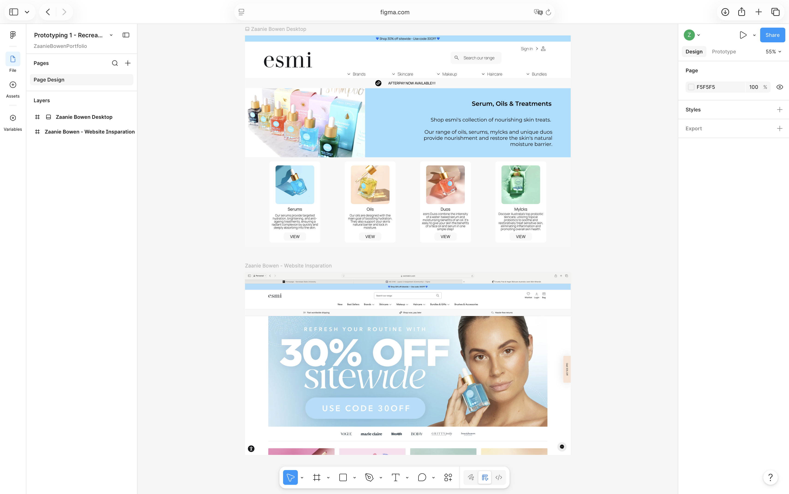
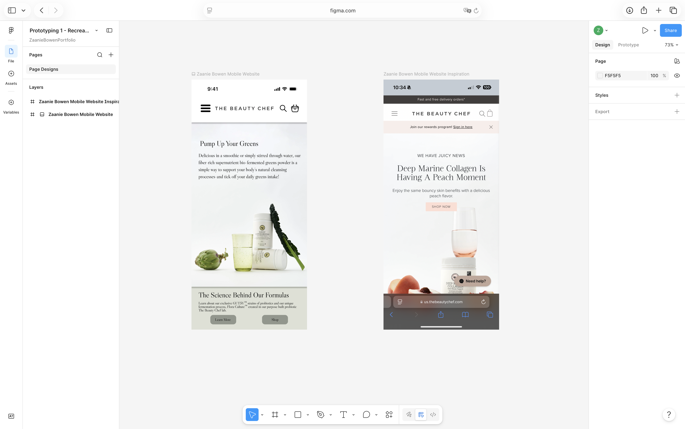
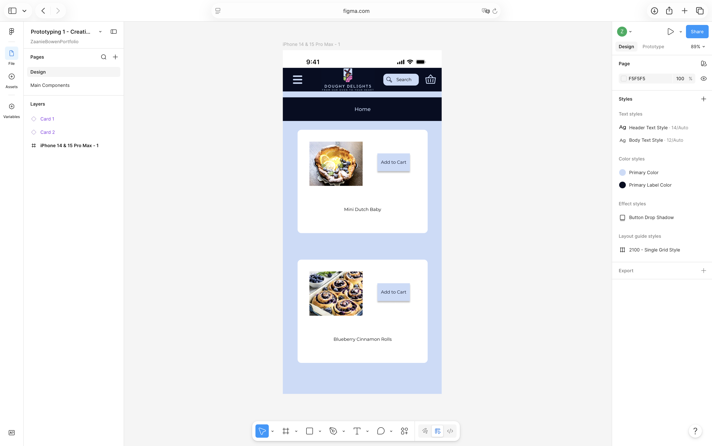
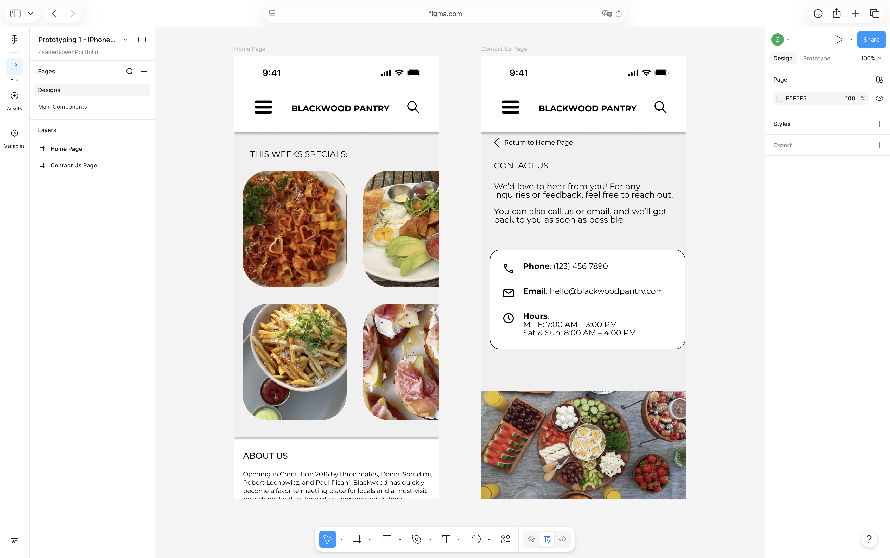
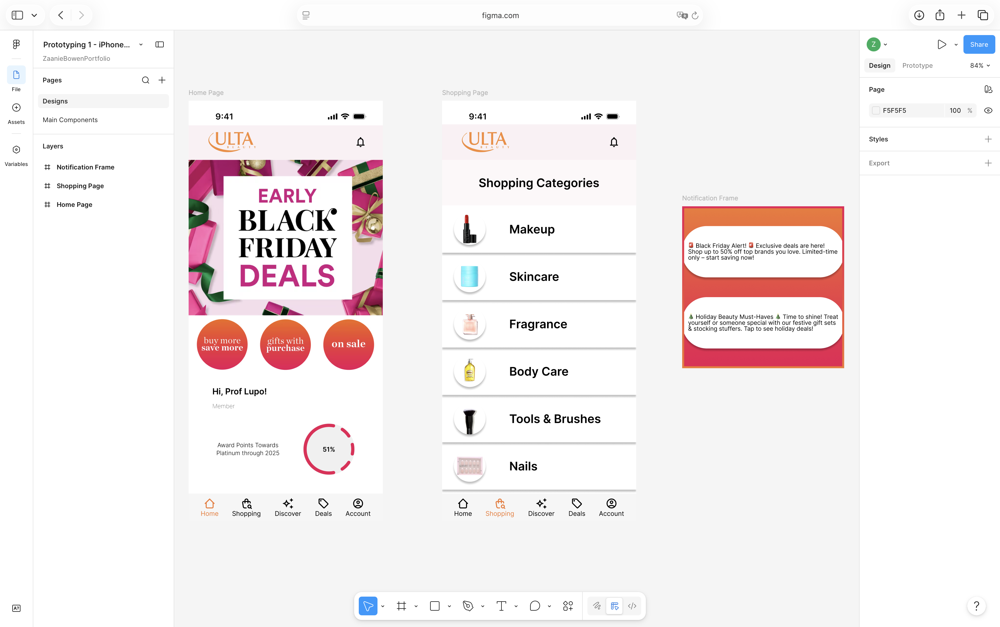
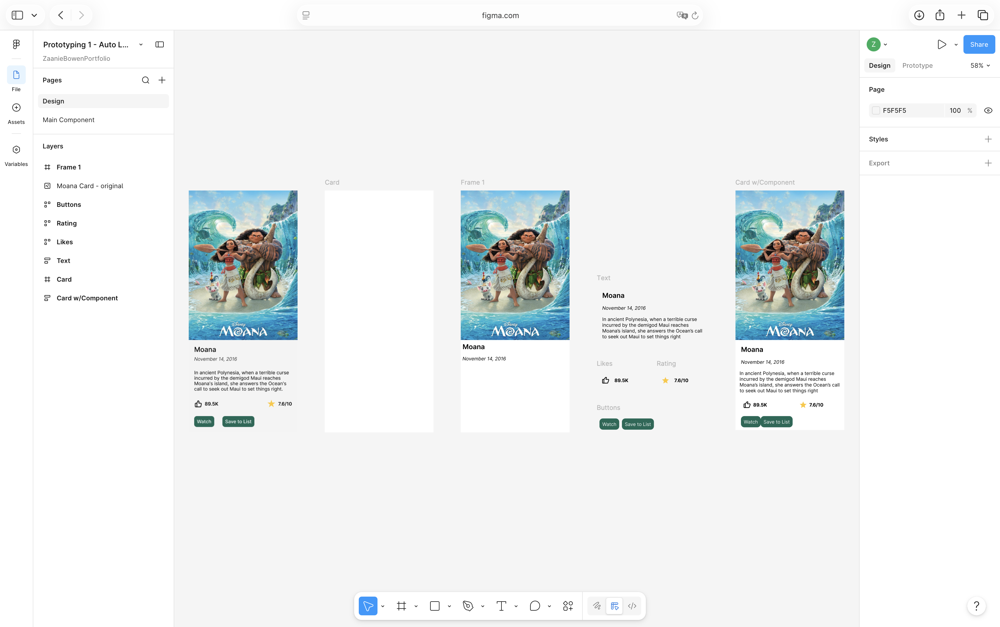
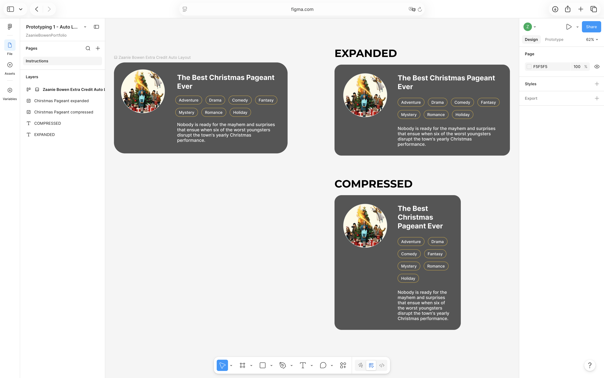
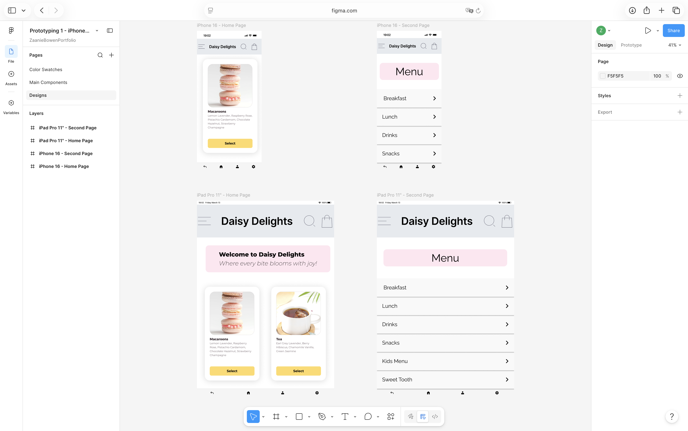

# UI/UX Design Projects

A collection of UI/UX design projects created in Figma, showcasing mobile application design, responsive layouts, component systems, auto layout, wireframing, and interactive prototyping.

These projects were completed as part of coursework and personal design exploration using Figma.

---

## Tools Used

- Figma
- Auto Layout
- Components
- Variants
- Design Systems
- Mobile UI Design
- Responsive Design
- Interactive Prototyping

---

# Projects

---

# 1. Esmi Website Recreation

**Screenshot:** The desktop skincare website featuring blue product cards and the "30% OFF Sitewide" promotional banner.

### Overview

This project recreates a modern skincare e-commerce website in Figma. The goal was to analyze an existing website and reproduce its structure, layout, typography, and visual hierarchy.

### Skills Demonstrated

- Website analysis
- Layout recreation
- Visual hierarchy
- Responsive planning
- Typography systems

### Figma Prototype

https://www.figma.com/design/sGafIlSb1NskCsq0AcXjEV/Prototyping-1---Recreate-a--Desktop--Webpage?t=VwJ3Lo6Ej36gfRZ3-1

---

# 2. Beauty Chef Mobile Website Recreation

**Screenshot:** The mobile wellness website featuring greens powder products and peach collagen promotions.

### Overview

A mobile-first recreation of an existing wellness brand website. This project focused on adapting a desktop experience into a mobile-friendly layout while maintaining usability and visual consistency.

### Skills Demonstrated

- Mobile-first design
- Responsive layouts
- Content prioritization
- Mobile navigation
- Information architecture

### Figma Prototype

https://www.figma.com/design/zTeEYmjw0r9p6wtJsQAzTl/Prototyping-1---Recreate-a--Mobile--Webpage?t=VwJ3Lo6Ej36gfRZ3-1

---

# 3. Doughy Delights Mobile App

**Screenshot:** The bakery application featuring menu items such as Mini Dutch Baby and Blueberry Cinnamon Rolls.

### Overview

A mobile bakery application concept created to explore product presentation, mobile navigation, and e-commerce design patterns.

### Skills Demonstrated

- Mobile application design
- Product card design
- User flows
- Navigation systems
- Design systems

### Figma Prototype

https://www.figma.com/design/Shro8OZT6DYzFkn50J7TeA/Prototyping-1---Creating-Components?node-id=14003-94&t=VwJ3Lo6Ej36gfRZ3-1

---

# 4. Blackwood Pantry Mobile App

**Screenshot:** The restaurant application displaying weekly specials and a contact page.

### Overview

A restaurant-focused mobile application concept featuring menu browsing, business information, and customer contact functionality.

### Skills Demonstrated

- Restaurant UX
- Mobile navigation
- Information hierarchy
- User-centered design
- Interface organization

### Figma Prototype

https://www.figma.com/design/efFwqgdMcSkTdWePEMjXib/Prototyping-1---iPhone-Restaurant-App?node-id=18002-109&t=VwJ3Lo6Ej36gfRZ3-1

---

# 5. Ulta Beauty Mobile App Redesign

**Screenshot:** The mobile shopping experience featuring Black Friday promotions, shopping categories, and notification cards.

### Overview

A redesigned mobile shopping experience inspired by the Ulta Beauty application. The project explores customer engagement, loyalty experiences, and e-commerce navigation.

### Skills Demonstrated

- Mobile commerce design
- Dashboard design
- User engagement features
- Shopping workflows
- Interface redesign

### Figma Prototype

https://www.figma.com/design/R0qKSkTlS3FmVeAQ1V7OD1/Prototyping-1---iPhone-Beauty-App?node-id=20002-83&t=VwJ3Lo6Ej36gfRZ3-1

---

# 6. Moana Movie Card Component

**Screenshot:** The movie card featuring Disney's Moana with ratings, likes, and action buttons.

### Overview

A reusable movie information card designed using Figma components. The project focused on creating scalable and reusable UI patterns.

### Skills Demonstrated

- Component creation
- Design systems
- Reusable UI elements
- Visual consistency

### Figma Prototype

https://www.figma.com/design/rxEsYhIgkw7LV5PewxkXxJ/Prototyping-1---Auto-Layout-Practice--2-?node-id=18003-94&t=VwJ3Lo6Ej36gfRZ3-1

---

# 7. Christmas Pageant Auto Layout Component

**Screenshot:** The card displaying "The Best Christmas Pageant Ever" in both expanded and compressed layouts.

### Overview

An Auto Layout exercise demonstrating how interface components can dynamically resize and reorganize content while maintaining usability.

### Skills Demonstrated

- Auto Layout
- Responsive components
- Adaptive design
- Layout systems

### Figma Prototype

https://www.figma.com/design/ApUiSrjZndt6sP2PlFXUGg/Prototyping-1---Auto-Layout-Practice?node-id=0-1&t=VwJ3Lo6Ej36gfRZ3-1

---

# 8. Daisy Delights Component System

**Screenshot:** The Daisy Delights logo with reusable cards and shared component examples.

### Overview

A component library created for the Daisy Delights application. The project focuses on creating reusable UI elements to maintain consistency across a product.

### Skills Demonstrated

- Design systems
- Component libraries
- Reusable UI patterns
- Consistent styling

### Figma Prototype

https://www.figma.com/design/AhIRGTYZO0QZBT3I5Fsx0N/Prototyping-1---iPhone---iPad-Bakery-App?node-id=22003-163&t=VwJ3Lo6Ej36gfRZ3-1

---

# Skills Demonstrated

Across these projects, I developed experience with:

- User Interface Design
- User Experience Design
- Mobile Application Design
- Responsive Design
- Wireframing
- Interactive Prototyping
- Auto Layout
- Components and Variants
- Design Systems
- Information Architecture
- Visual Hierarchy
- Accessibility Considerations

---

# Author

**Zaanie Bowen**

Portfolio: https://zaaniebowen.dev

GitHub: https://github.com/Zaanie10

LinkedIn: https://www.linkedin.com/in/melezaan-bowen-1bb690200/

---

*These projects showcase the design thinking, prototyping, and interface design processes used to create user-focused digital experiences.*
